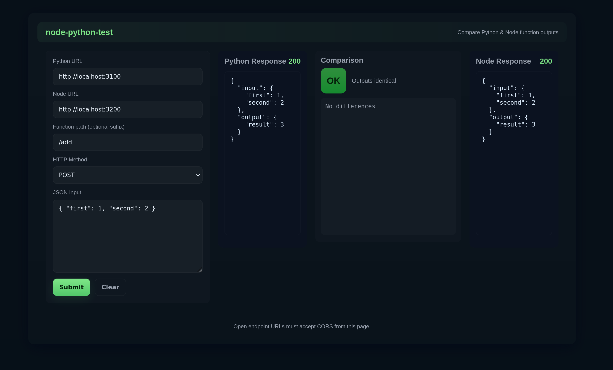
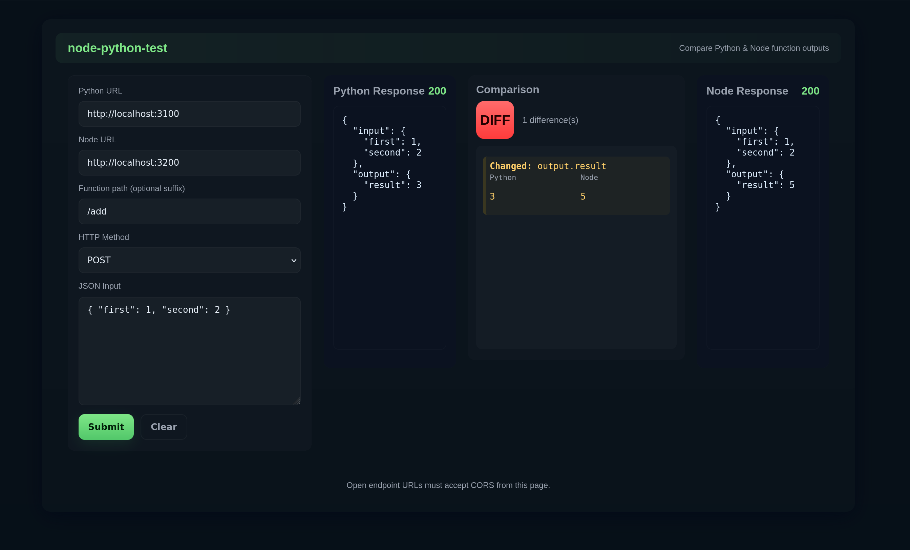

# node-python-test

Simple tool to test python and node functions, useful if you're trying to port a function from one language to the other.

Creates a server API for both python (flask) and node (express) + a simple html/js page that makes a call with the same POST parameters to both servers, then compares the output of each.

## What it does
- Dynamically loads functions from a `functions/` folder in each server app and exposes each file as a POST endpoint named after the file (e.g., `functions/add.py` or `functions/add.js` -> `/add`).
- Every endpoint accepts JSON POST input, passes that input to the function, and returns a uniform response: `{ "input": <posted json>, "output": <function return> }`.
- `compare/index.html` is a tiny client you can open in a browser to call a Python URL and a Node URL for a given function and payload, show both outputs, and indicate whether they match.




## Quick start — Python
0. Install whatever version of python you want
1. Go to /python folder
2. Create a virtualenv and activate it (optional).
3. Install:
   ```
   pip install -r requirements.txt
   ```
4. Start server:
   ```
   python server.py
   ```
5. POST JSON to `http://localhost:3100/<function>` (e.g. `/add`).

To add a function: add `functions/<name>.py` that exports a callable (e.g. `def run(...)` or same-name function). The server will register `/name`.

## Quick start — Node.js
0. Install whatever version of node you want
1. Go to /node folder
2. Install Node and dependencies:
   ```
   npm install
   ```
3. Start server:
   ```
   npm start
   ```
4. POST JSON to `http://localhost:3200/<function>`.

To add a function: add `functions/<name>.js` that exports a function (export `run` or named export matching the filename). The server will register `/name`.

## Using compare/index.html
1. Open `compare/index.html` in a browser (file:// is fine).
2. Enter:
   - Python base URL (e.g. `http://localhost:3100`)
   - Node base URL (e.g. `http://localhost:3200`)
   - Function name (e.g. `/add`)
   - JSON payload (e.g. `{"first":1,"second":2}`)
3. Click "Compare". The page will POST the payload to both endpoints, display each raw response, and show whether outputs match.

Notes:
- Functions should accept the same input shape and produce comparable outputs for valid comparison.
- Comparison is a strict JSON equality check.

---

### MIT License
